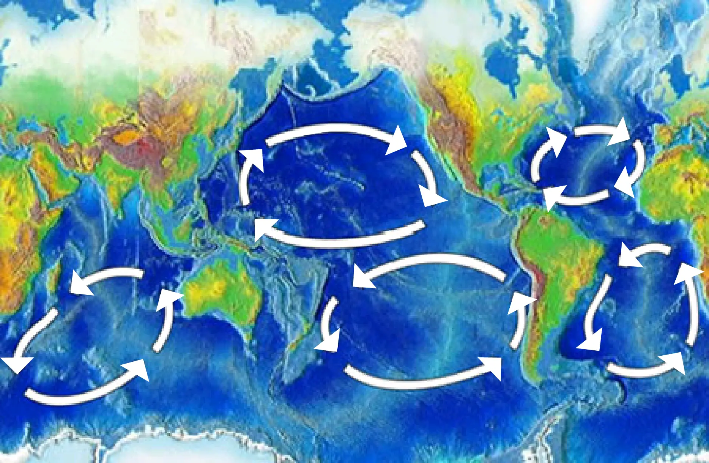
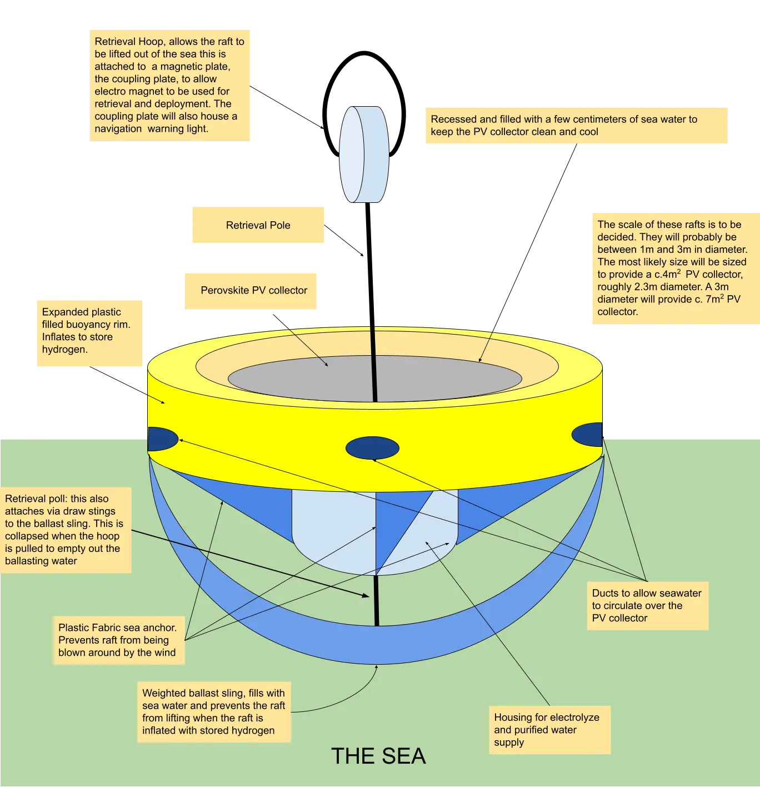
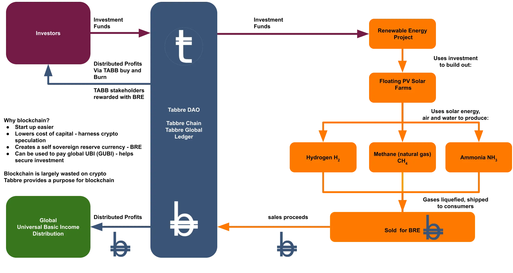

# The Tabbre Project Explained

**Our mission is to solve the climate crisis and help end global poverty**

## Introduction

This light paper provides a brief description of  the Tabbre project. The Tabbre Project mission is to solve the climate crisis and help end global poverty by harnessing the power of blockchain and crypto scarcity to fund the development of cheap and plentiful sustainable renewable energy at a global scale. 

## The problem
At the moment, sustainable renewable energy is very expensive when compared to fossil fuel derived energy. This is because the scale of infrastructure that is needed to capture enough sunlight and wind energy to cope with intermittency and seasonality is enormous and hence very expensive. This is slowing the transition from fossil fuels. If we are to achieve a sustainable and prosperous future we need renewable energy to provide a cheaper alternative to fossil fuels.

## Floating Solar Farms
Tabbre intends to satisfy the world’s energy needs by creating vast oceanic photovoltaic solar farms. These will consist of flexible lightweight floating structures made from recyclable plastic. They will be located in the oceanic gyres of the South Atlantic, South Pacific and South Indian Ocean. These oceanic gyres are deserted, largely sterile, tropical international waters covering tens of millions of square kilometres. 

It is intended that the entire solar farm infrastructure will be fully automated using robotic AI and once complete, there will be no requirement for new materials such as steel, aluminium and plastics because at the end of their useful life, every component will be recycled in fully automated and autonomous facilities.

The electricity generated will be used to electrolyse water into hydrogen and oxygen. Much of the hydrogen can be converted to methane or ammonia. The hydrogen, methane and ammonia gases will be compressed or liquefied for shipping to consumers as a clean chemical fuel replacement for fossil fuels such as coal, natural gas and oil. Using solar energy to produce hydrogen, methane and ammonia solves the problem of intermittency since these fuels, unlike electricity, can be easily transported and stored for later consumption.

Tabbre’s sustainable energy will be much cheaper and more plentiful than fossil fuels, and so market forces will drive the transition from fossil fuels to sustainable energy. Also because Tabbre’s sustainable renewable energy can be delivered as hydrocarbon fuel, existing gas, oil and coal burning industrial, commercial and transport equipment can continue to be used. This will make the transition to sustainable energy easier, cheaper and faster.

# **Tabbre Blockchain**

To make this vision possible, Tabbre is creating two new cryptocurrency assets: Tabb and Bre. These will be expressed on a new blockchain, the Tabbre Chain.  The Tabbre Chain uses a proof of stake consensus.

Tabb is like Bitcoin in that it has a fixed maximum supply. 

A large fraction of all Tabb will be held by a decentralized foundation, The Tabbre Foundation. The Foundation’s Tabb holdings will be used as collateral for debt finance to fund the development of these oceanic floating solar farms.

Bre will be issued and managed by the Tabbre decentralized foundation using an algorithmic method to ensure the value of Bre remains stable. 

The sustainable energy generated by Tabbre will be priced and sold for Bre.

Bre will be backed by the value of energy generated by the Tabbre scheme.

As Tabbre develops, all profits generated by the scheme will be reinvested into more renewable energy capacity until a target energy output is reached. 

At this point, called the distribution point, profits will be distributed. 

The Tabbre decentralized foundation will distribute profits to Tabb holders by using the profits to buy and burn Tabb. The intent is to cause significant appreciation in the value of Tabb.

The Tabbre Chain will provide a smart contract execution environment so that the smart contracts that encode the decentralized foundations governance and tokenocracy rules can be processed. The governance smart contracts are amendable using a proof of stake voting system. This allows the Tabbre system to grow and evolve over time to reflect society's changing needs.

# **Tabb & Bre**

Tabb is like Bitcoin in that it has a fixed maximum supply. A large fraction of all Tabb will be held by a decentralized foundation, The Tabbre Foundation. The Foundation’s Tabb holdings will be used as collateral for debt finance to fund the development of Tabbre’s oceanic floating solar farms.

Bre will be issued and managed by the Tabbre decentralized foundation using an algorithmic method to ensure the value of Bre remains stable. The renewable energy generated by Tabbre will be priced and sold for Bre. Bre will be backed by the value of energy generated by the Tabbre scheme.

As Tabbre develops, all profits generated by the scheme will be reinvested into more renewable energy capacity until a target energy output is reached. At this point, called the distribution point, profits will be distributed. The Tabbre decentralized foundation will distribute profits to Tabb holders by using the profits to buy and burn Tabb. The intent is to cause significant appreciation in the value of Tabb.

Bre is created dynamically on the Tabbre blockchain, in accordance with the Tabbre system's governance rules.

Tabb has a limited supply. All Tabb is created on the Tabbre Chain in its genesis event. After this no new Tabb will be created. 

Tabbre will be a censor resistant global monetary system that will supplement and compete with the world’s existing fiat based banking systems.

# **The Tabbre Universal Basic Income**

Tabbre is expected to be hugely profitable when it achieves its objective of being the principal global supplier of energy.

Tabbre’s solar farms are located in international waters that are considered global commons, so in the interests of social fairness and social cohesion and as a protection against confiscation by avaricious and corrupt governments, Tabbre intends to use a significant fraction of profits from the scheme to fund a global universal basic income (UBI). This will be distributed in Bre.

Bre’s role in paying the global UBI coupled with Bre’s role as the currency for trading energy will allow Bre to become a non national self-sovereign decentralized global reserve currency.

The Tabbre Project will help transition the world from fossil fuels and establish a global decentralized financial system and in so doing will help end both the climate crisis and global poverty.
