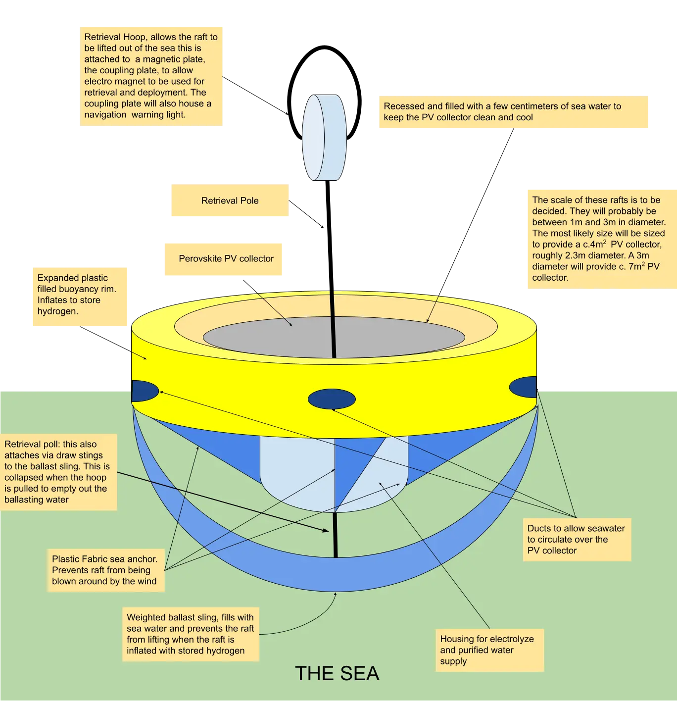
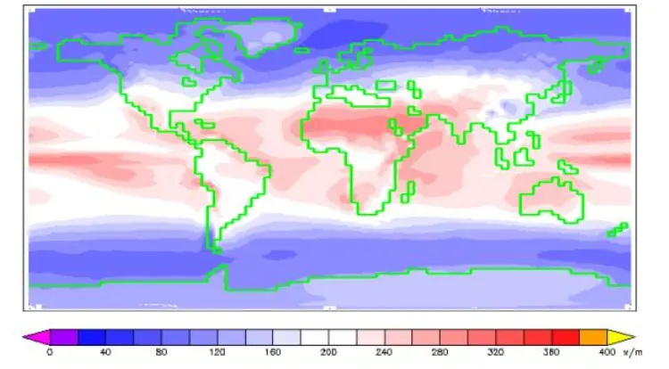

# **Tabbre’s** **Floating Solar Farms** **Explained**

**Charles Cunningham**

**London**

**October 2024**

# **Executive Summary**

The Floating Solar Farms project, proposed by Tabbre, introduces an innovative solution to the challenges of renewable energy. Traditional renewable energy sources, such as wind and solar, are costly due to their intermittency and the need for large-scale storage systems. To address these issues, Tabbre proposes floating solar farms located in the remote oceanic gyres of the South Atlantic, South Pacific, and South Indian Oceans. Utilising cutting-edge thin-film perovskite photovoltaic technology, these solar farms will convert sunlight into electricity efficiently, while being cost-effective and environmentally sustainable.

The solar farms will consist of lightweight, flexible rafts covered in solar cells that produce hydrogen through electrolysis. This hydrogen will be stored and collected by automated harvester vessels, which will transfer it to floating factory platforms. The hydrogen will then be converted into ammonia, methane, or other refined fuels, all of which will be clean alternatives to fossil fuels. The project is designed to be entirely self-sustaining, recycling its materials and requiring minimal human intervention through advanced AI and robotic automation.

With a phased development road map, the project aims to scale from a 1 GW system to a multi-terawatt capacity by the 2030s. It represents a significant opportunity for reducing the global reliance on fossil fuels while being economically competitive.

# **Introduction**

# **The problem: renewable energy is expensive**

The challenge of replacing fossil fuel based energy with renewables is considerable. Fossil fuel is abundant, cheap, easy to extract, refine and store and consume. Being chemical potential energy, it can be extracted from the ground, transported to where it’s needed and consumed by burning to produce energy on demand. 

Renewable energy on the other hand is largely extracted from wind and sunlight. These sources of energy are used to generate electricity. This leads to problems of intermittency. Electricity is generated when the sun is shining or the wind is blowing. These sources of energy are intermittent, the wind doesn’t always blow and the sun only shines during the day, and depending on the location may often be obscured by clouds. Also in non equatorial locations the strength of the wind and duration of available sunlight are seasonal. 

The intermittency and seasonality of renewable energy requires considerable capital investment to overcome. Electrical energy needs to be converted to potential energy for storing and then converted back from potential energy to electrical energy on demand. This conversion to and from potential energy can result in considerable loss of energy through unavoidable inefficiencies. 

Generally speaking, the cheaper the storage medium the less efficient it is. Renewable energy schemes need to have significant over capacity so that they can generate enough energy when the wind is blowing or sun is shining to meet the immediate demand for energy and also to fill the energy storage so that demand can be met when the renewable scheme is not generating energy. 

For solar schemes based in tropical countries, the required generating capacity is perhaps 5 or 6 times the peak expected demand. In higher latitudes, the excess capacity is even greater because of seasonality: winter days are short and often overcast. This seasonality makes solar largely economically unviable in higher latitudes unless it’s coupled with other sources of energy. 

It should be noted that wind energy is also seasonal. In the North Sea, for example, the highest wind speeds occur in the autumn and spring. The least windy days are often the coldest or hottest days of the year, just when the energy is needed the most. The whole north sea can experience periods when the wind doesn’t blow. These becalming episodes can last up to a week. A grid level infrastructure will need to provide enough energy storage to ensure that such becalmings do not result in week long blackouts.

The need for massive infrastructure over provision and significant energy storage capacity makes renewable energy very expensive when compared to fossil fuel energy. If we are to achieve a sustainable prosperous future we need to solve this problem. 

Cheap energy is essential for economic prosperity and security. The developing countries of the world are not going to allow their peoples to be denied the benefits of modernity. These benefits can only be achieved through the adoption of energy intensive industry, agriculture, transport, housing and computing. At the moment this means using fossil fuels.

Land based solar farms are expensive as they are made from glass, steel, concrete and silicon. Huge quantities of these materials are needed because solar farms need to be huge because only about 20% of the energy in sunlight can be captured, and sunlight isn’t a very concentrated source of energy. For example, a one gigawatt solar installation, located in the tropics, that is capable of delivering one gigawatt of electricity to a grid 24x7 will need over 30,000,000 square metres (30 square kilometres) of solar collector. 

This figure assumes a 90% thermal efficiency for the 20 gigawatt hour energy store that will be used to deliver electricity to the grid when the sun is not shining. This energy store is likely to be some form of battery. The capital cost of such a scheme is enormous. This approach is unaffordable at a global scale. Too much expensive material is needed. 

For the entire world to be powered by solar energy, assuming that the average consumption of electricity will be 2 kilowatts per person and that the global population is 9 billion people, this will require 18 terawatts of solar energy capacity, or 18,000 Gigawatts. This is about 540,000 square kilometres of photovoltaic. In practice more will be needed because of the need to store energy to accommodate seasonal changes in output and demand. 

If we are to achieve decarbonization and sustainable global prosperity we need to find a more economic way of harnessing renewable energy. The Tabbre Project provides the answer to this challenge.

# **The Tabbre Solution**

The recent development of thin film perovskite photovoltaic technology has made possible the creation of plastic floating photovoltaic cells that will be efficient in converting sunlight to electricity, cheap and rugged and if kept cool, long lasting. 

Tabbre proposes to use perovskite photovoltaic technology to build floating solar farms. These will be located in the oceanic gyres of the South Atlantic, South Pacific and South Indian Ocean. These oceanic gyres are deserted, largely sterile tropical waters covering millions of square kilometres that are devoid of oceanic currents. 

The floating photovoltaic solar farms will consist of flexible lightweight floating rafts made from inexpensive and highly durable recyclable plastic. The photovoltaic surface will use a perovskite coating applied to aluminized plastic foil. This plastic foil is similar to the plastic used in crisp, potato chip, packets. 

Perovskites are made from cheap and plentiful raw materials such as hydrocarbons and very small quantities of lead. These rafts will be flexible so that they can bend and flex with the waves. This means they can be much lighter and cheaper than rigid land based structures.

**Polymer based perovskite solar generated electricity is expected to be more than an order of magnitude cheaper than electricity generated by land based solar farms. Modelling suggests a price of less than 0.1 US cent per KWh.**

Each Solar Raft will have an integrated electrolyser and associated reservoir of desalinated water. The electrolyser will use the electricity generated by the PV cell to convert the purified water into hydrogen and oxygen. The oxygen will be vented off and the hydrogen will be stored on the Solar Raft in an inflatable structure. It is envisaged that the only moving parts in these rafts will be the valves that control the flow of the hydrogen, oxygen and water in the electrolyzer unit.

The hydrogen will be collected and converted by fully automated floating factory platforms into either ammonia or methane. The ammonia will be created by combining the hydrogen with nitrogen taken from the air and the methane will be created by combining the hydrogen with carbon dioxide extracted from the air. The ammonia will be liquefied for storage and shipping to consumer markets. The methane may also be liquefied and shipped to consumer markets, however it might also be subject to further processing to turn it into refined oil products such as petrol, diesel and paraffin. Both the liquefied methane and the oil products will be shipped to consumer markets as a clean fuel replacement for fossil fuels. 

These floating solar farms are described in more detail in the following sections of this document.

# **How floating solar farms will work**

The Tabbre solar farms will consist of flexible plastic rafts covered with a flexible plastic photovoltaic solar film. This is likely to be suspended a few inches under the surface of the water to keep it clear of debris and other cruft and also to help keep it cool. Cooling helps with both the efficiency and longevity of the photovoltaic surface.

The electricity generated by the solar raft will be used by the raft's on-board alkaline electrolyser to convert filtered water into hydrogen and oxygen. The oxygen will be vented off and the hydrogen will be stored by inflating the raft. The inflatable storage will probably be able to store hydrogen gas at up to 2 bars of pressure.

Periodically the rafts will be visited by harvester vessels. These vessels will extract the stored hydrogen and replenish the raft’s filtered water supply. The harvester vessels will also inspect rafts for damage and clean them. This process is expected to require the harvesters to lift the rafts from the sea and onto their decks.

The harvester vessels themselves will rendezvous on a periodic basis with floating factory platforms. The harvesters will transfer their stored hydrogen to the floating factory platforms and will receive replenishment for their spare rafts and filtered water supplies.

### **Solar PV Raft Description**

The core of the Solar Sea concept is the solar raft. These will be designed to be durable, cheap and efficient. The following is a description of a concept raft, the actual design and configuration of production rafts will be the subject of a research and design process.

The raft will be circular in shape and will resemble a child's paddling pool in that it will have an inflatable wall that rises above a flat flexible inner surface. This surface will be constructed as a flexible photovoltaic panel using a perovskite based photovoltaic (PV) material to convert solar energy into electricity. This will be waterproof and will be submerged in a few centimetres of sea water to help keep the surface clear of obstructing cruft. Submerging the photovoltaic panel under a few centimetres of sea water will also help to keep it cool. 

Because there are no currents, the rafts can be sea anchored to prevent them from being moved by the wind. Sea anchors are made of cloth and act as a brake, providing hydrodynamic drag to prevent the raft from being moved by the wind. The rafts' sea anchors are just under the surface, and the water moving past them keeps them filled.The size of the sea anchor determines how much water it can displace and how much braking it can provide.

The electricity generated by the raft’s PV surface is used to electrolyse water into hydrogen and oxygen. The oxygen is vented off and the hydrogen is stored on the raft in the raft’s inflatable perimeter. 

The hydrogen is produced in an alkaline electrolyser that is housed under the raft. This will be made from moulded plastics and will have a small reservoir of purified water. The only moving part in the raft will be the valves that control the flow of gases and water in and out of the electrolyser.

The housing of the electrolyser will provide a mount point for a rigid rod, the “retrieval pole”.This rod will be topped with a hoop, the “Retrieval Hoop” that is attached to a vertical flat magnetic plate. This arrangement allows the raft to either be hooked out of the water or lifted with an electromagnet. 

The retrieval rod will be attached to cords that run under the raft and attach to the ballast sling. In normal deployment the ballast sling is slightly weighted so that it sinks into the water and it is shaped to hold water to prevent the raft from being lifted out of the sea by the buoyancy created when it inflates with hydrogen.

When the retrieval rod is pulled as the raft is lifted, the rod slides up slightly pulling on the cords attached to the ballast sling, this causes the ballast sling to deform and in so doing release the water it contains, making the raft much lighter to lift.

The intention of this design is to make the raft light to lift from the centre but very heavy to lift from the edges so that the wind can not lift the rafts from the water.

The rafts are likely to have a PV surface area of 8 to 12m2. For a circular raft, the PV panel diameter is 3 to 4m. The productivity of these rafts will be considerable, for example an 8m2 raft will produce about 0.12 Kg of hydrogen a day. 

If the rafts are harvested after 5 days, a raft will need to store 5 days production of hydrogen, about 0.6Kg of hydrogen. The hydrogen will be stored at near atmospheric pressure in the inflatable rim of the raft. This will need a capacity of about 10m3. To deliver this capacity, the fully inflated diameter of the raft will be 5m,the fully inflated depth of the raft’s inflatable rim will be 1 metre.

The empty mass of a raft including the electrolyser and other components will be in the order of 10 to 20 Kg.

#### Harvesting

The hydrogen generated by the solar rafts will need to be collected so that it can be processed into either ammonia or methane or simply compressed or liquefied. The process of collecting the hydrogen is referred to as harvesting and will be performed by small vessels called harvesters.

The frequency of harvesting will be determined by the solar raft’s storage capacity for hydrogen. The hydrogen will be stored at twice atmospheric pressure on the rafts. Hydrogen is a very light gas, being a fifteenth the density of air. The expected storage capacity of a raft will be about 10 days production of hydrogen. This means that the rafts will need to be attended to every 10 days or 240 hours.

To accelerate the process of harvesting, it is envisaged that the harvesters will physically lift the solar rafts out of the sea.

 

The harvesters will be robotic and have no facilities for human crew. They will be electrically powered with the electricity generated from a hydrogen powered fuel cell.

The harvesters will have robotic crane arms for catching and lifting rafts.

The rafts will be lifted from the sea onto the main deck where they can be serviced by robotic machinery. The hydrogen will be extracted and the distilled water supply replenished. Once the hydrogen has been extracted from the raft and its desalinated water replenished, the raft will be deployed back to the sea.

 

The hydrogen extracted from the rafts will be compressed and stored aboard the harvester. 

The physical configuration of the harvesters will be based on the SWATH concept. 

A SWATH (Small Waterplane Area Twin Hull) boat is a specialised catamaran design that minimises the hull's cross-section area at the water's surface. The key features of a SWATH boat are:

- The bulk of the boat's displacement is located beneath the waves, where it is less affected by wave action. This minimises the boat's response to sea state, even in high seas and at high speeds.

- The twin-hull design provides a stable platform and large, broad decks.

- Compared to conventional catamarans, SWATH vessels have more surface drag but less wave drag. They are less susceptible to wave motion but more sensitive to payload, which affects draft.

- SWATH boats cannot operate in planing or semi-planing modes and thus do not gain drag reduction at higher speeds like some other boat designs.

- SWATH boats require a complex control system, have a deeper draft, and have higher maintenance requirements compared to other boat types.

Common applications for SWATH boats include research vessels, pilot boats, offshore support vessels, and yachts, as the stable platform and reduced motions are beneficial for these uses.

In summary, the SWATH design sacrifices some speed and efficiency for greatly improved seakeeping and stability, making it well-suited for operations in rough seas.

A schematic diagram of a harvester is shown below. The craft illustrated here will  be 16m long and slightly over 8m wide. 

The harvesters will be fully automated using artificial intelligence robotic automation. The harvesters will never be crewed by people.

Harvesters will make extensive use of satellite navigation and machine vision to locate and handle rafts.

#### Factory Platforms 

When a harvester rendezvouses with a floating factory platform, the factory platform will lift the harvester from the sea to its deck. The harvesters will use compressed hydrogen storage cylinders housed in standard shipping container encasements as shown in this picture. 

This will simplify the process of transferring the hydrogen from the harvester’s storage into the factory platform’s storage. The hydrogen transfer is achieved by swapping a full container for an empty container.

The harvester’s reservoir of desalinated water will also be replenished. Once this is completed the harvester will be placed back in the sea so that it can resume harvesting.

The factory platforms will process the stored hydrogen into either ammonia or methane. These gases will be liquefied and stored aboard the floating factory platform.

 

The specialist liquid gas transporters will rendezvous with floating factory platforms. The liquefied methane and ammonia will be transhipped to the gas transporters. These transporters will travel to destination ports near to the consumer markets where they will off load their cargos of liquefied gas.

#### **Desalination**

A large amount of desalinated water is required for electrolysis. One kilogram of hydrogen will require 9 kilograms of water.

Fortunately, desalination technology has come a long way: modern desalination plants typically use molecular filters to remove the salt from seawater. This is much more energy efficient than evaporation techniques. Much of the hydrogen produced by Tabbre’s solar farms will be consumed by the scheme itself as it converts hydrogen into methane and ammonia. Our assumption is that the hydrogen consumed internally by Tabbre will result in water that can be captured and reused. This limits the amount of desalination needed. 

The purified water needed for electrolysis may be produced on the harvesters by using a desalination process, probably filtration based. It may also be possible to design solar rafts to capture rainwater. 

The locations of the solar farms in the southern oceanic gyres receive the global average amount of rainfall . This is between 0.8 and 1 metres per annum, meaning that a 10m2 solar raft could collect over 8 tonnes of water per year. This water will still need to be filtered and desalinated because it is likely to be contaminated by seawater, but it will be much less brackish on average than the sea itself. This greatly reduces the amount of energy needed for desalination.

It may even be possible to integrate desalination into the solar rafts themselves. This would greatly reduce the complexity of the desalinated water supply chain.

#### **Hydrogen Processing**

Hydrogen extracted from rafts will be compressed by the harvesters and stored in its ISO standard shipping container hydrogen store. This compressed hydrogen will be either shipped to customers or liquefied on the factory platforms and shipped as liquid hydrogen to customers.

The hydrogen not destined for customers will be or used to create either ammonia or methane.

It should be noted that all the scheme's internal energy requirements will be met by using hydrogen as fuel. The harvesters and factory platforms will be hydrogen powered and the transport ships will be fueled by their cargos.

#### **Ammonia Production**

The following diagram shows the on harvester ammonia production process.

Tabbre’s ammonia will be manufactured through the Haber-Bosch process, which was developed in the early 20th century by German chemists Fritz Haber and Carl Bosch and as such is a mature technology.

The key steps in the Haber-Bosch process for ammonia production are:

- Hydrogen: This is taken from the harvester’s compressed hydrogen storage
- Nitrogen production: Nitrogen will be obtained by either the fractional distillation of liquefied air or through combusting hydrogen in air to produce water vapour and hydrogen rich air. The energy generated from this process will be used to power the harvester.
- Ammonia synthesis: This will be performed in the Ammonia Production Cell where the hydrogen and nitrogen gases are compressed to high pressures (150-200 atm) and heated to 450-500°C. They are then passed over an iron-based catalyst, where they react to form ammonia according to the reversible reaction: N2 + 3H2 ⇌ 2NH3. This is an exothermic reaction, so lower temperatures favour higher ammonia yields.
- Ammonia separation and purification: The ammonia produced is then cooled and condensed, separating it from the unreacted hydrogen and nitrogen. The unreacted gases are recycled back to the synthesis reactor in the Production Cell.

The Tabbre Project will invest in research in other emerging technologies for ammonia production including electrochemical and thermochemical processes with the intention of productionizing these once they become commercially viable.

The normal industry standard for the thermal efficiency of the Haber-Bosch process puts the energy requirement of 27.4 - 31.8 GJ per ton of ammonia, representing an overall energy efficiency of 62 - 65%. However this includes the energy used to convert fossil fuels to hydrogen. The Tabbre process will use hydrogen from the floating solar farms, so given that up to 70% of the exergy (capacity to do work) destruction occurs in the steam methane reformer, where energy is downgraded during the conversion of chemical energy in the fuel to thermal energy, this implies that 30% of the exergy destruction will be eliminated so the actual thermal efficiency of the Haber-Bosch process proposed by the Tabbre project using the best available technology will be 73 - 76% efficient.

 

The initial customers for Tabbre’s ammonia will be existing users of ammonia. This has the potential to greatly reduce the current significant environmental impacts of ammonia production, especially high carbon emissions. 

The Haber-Bosch process for ammonia production, which accounts for over 85% of global ammonia production, relies heavily on fossil fuels and is responsible for 451 million metric tons of CO2 emissions per year, which is about 1.8% of global CO2 emissions.

Tabbre, by developing its sustainable, zero carbon method of ammonia production using renewable energy, is crucial to the mitigation of this.

#### **Methane Production**

The conversion of hydrogen collected from the solar rafts into methane will be achieved using a methane production process based on the Sabatier reaction.The CO2 will be supplied either using a direct air carbon capture system or by extracting dissolved CO2  from seawater.

##### **Sabatier reaction**

The Sabatier reaction combines hydrogen gas with carbon dioxide (CO2) from the air to produce methane and water vapour:

CO2 + 4H2 → CH4 + 2H2O

This reaction occurs at elevated temperatures, optimally between 300-400°C, and elevated pressures around 3 MPa (30 bar), in the presence of a nickel catalyst.

The steps are:

1. Use the hydrogen taken from solar rafts
2. Extract carbon dioxide from the air 
3. Feed the hydrogen and carbon dioxide gases, in the optimal 4:1 ratio, into a reactor containing a nickel or ruthenium catalyst bed.
4. The reactor is heated to 300-400°C and pressurised to around 3 MPa.
5. The Sabatier reaction occurs on the catalyst surface, producing methane and water vapour.
6. The methane can then be purified and used as a renewable synthetic natural gas or fuel.

The typical efficiency of the Sabatier process for converting hydrogen and carbon dioxide into methane ranges from around 78% to 97.6%.

#### **Carbon dioxide**

The Tabbre project is considering two possible alternatives for collecting the carbon dioxide required for the Sabatier process. These are direct air carbon capture, whereby carbon dioxide is extracted from the air or sea water carbon capture, whereby carbon dioxide is extracted from the sea. It should be noted that the carbon dioxide in seawater comes from the air, and so is a slightly indirect way of extracting CO2 from the atmosphere.

##### **Direct Air Carbon Capture**

Calcium-based materials, particularly calcium oxide (CaO) and calcium hydroxide (Ca(OH)2), can be used to extract carbon dioxide (CO2) from the air through a process called carbonation. The key steps are:

- Air is drawn into a contactor structure, where it comes into contact with a solution of potassium hydroxide (KOH). The CO2 in the air reacts with the KOH, forming a solution of potassium carbonate (K2CO3).
- The potassium carbonate solution is then treated with a slurry of calcium hydroxide (Ca(OH)2). This causes the CO2 to precipitate out as solid calcium carbonate (CaCO3) pellets.
- The calcium carbonate pellets are then heated to around 900°C in a calciner. This causes the CaCO3 to decompose, releasing pure CO2 gas that can be captured and stored or utilised.
- The heating also leaves behind calcium oxide (CaO), which is then mixed with water in a "slaker" to reform calcium hydroxide (Ca(OH)2). This calcium hydroxide is recycled back to the second step to continue the cycle.
- The key advantages of this calcium-based CO2 capture process are:
  - Calcium-based materials like CaO and Ca(OH)2 are inexpensive and widely available.
  - The process can capture CO2 directly from the air, not just from point sources.
  - The captured CO2 is in a pure, concentrated form ready for storage or utilisation.

Overall, this calcium looping process provides a promising approach for direct air capture of CO2 that can be done in a cost-effective and scalable manner.

The key to its deployment is managing the heat to ensure that heat is recycled to minimise the energy consumed by the process.

##### **Seawater Carbon Capture**

In recent years, the ocean has come to be recognized as a global-scale reservoir for atmospheric CO2.

Recent research conducted by the Department of Chemical Engineering at MIT has produced a viable method for extracting CO2 from seawater. This provides a potential alternative approach that may be more efficient than direct air capture. 

#### **Further processing**

The methane that is produced may either be liquefied for transport to consumer markets or it can be converted by the floating factory platforms into other products such as methanol, paraffin, petrol and diesel. These products have the merit of being liquid making their storage and transportation much easier.

### **Transporters**

It is envisaged that there will be a number of types of liquefied gas transport ships: ammonia transports, methane transports, Hydrogen transports. Gaseous hydrogen is expected to be shipped in containerised 300 bar pressure tanks.

In the case of ammonia and methane, these will be collected and transported by liquified gas transport ships. These will rendezvous at sea with floating factory platforms. The floating factory platforms will tranship their ammonia or methane to the transport and likewise for liquid products.

The transporters will be fueled by their cargos.

The floating factory platforms and transports will follow an optimised path to minimise the time spent travelling between rendezvous.

It is estimated that a transporter will be able to make 10 round trips per year, taking cargo from the floating factory platforms to consumer ports. This is based on an assumption that the transports will have to travel about 26,000 Km on each round trip. This means that the total transport capacity will need to be a tenth of the total output of the scheme. For example if the output is 8 billion tonnes per year of hydrocarbon fuels, the transport fleet will need a capacity of 800 million tonnes. If the average transporter capacity is 200,000 tonnes , this implies a fleet of 4000 transporters.

## **Automation and Manufacturing** 

The key to delivering the vision of cheap, abundant and reliable renewable energy lies in reducing the cost of manufacturing to as close to nothing as possible such that the cost of the various components of the floating solar farm scheme are as close to the cost of the raw materials used to make them as possible. The cost of the raw materials also needs to be driven down to as close to zero as possible.

This can be achieved through robotic automation and recycling. Robotic automation will reduce labour costs to close to zero and recycling will reduce raw material costs to close to zero too once the initial build out of the capacity needed is achieved.

The Tabbre Project believes that the advent of working AI based on algorithmic neural nets will enable the creation of fully autonomous unmanned facilities for producing, deploying, maintaining, servicing and operating all the principal components of this scheme. 

## **Recycling**

A central element of the economic model for the scheme is that every component of the scheme including the transport ships, floating factory platforms, harvesters and solar rafts will be fully recycled with no wastage. The energy required to do this will be generated by the scheme itself and so will be fully renewable. This will also have a useful side effect: the scheme's operating costs, once fully operational, will be very close to zero

## **Environmental impact**

### **Zero impact**

The Tabbre scheme is designed to have a zero harmful effect on the environment while delivering a massive societal benefit.

The oceanic gyres that Tabbre proposes to use are in the South Atlantic, South Indian and South Pacific Oceans. These areas of water are extremely remote. They are so far from land that the surface waters contain very little bio available iron. The iron present in oceanic water originates from windborne sand. The oceanic gyres are so far from land, very little of this windborne sand reaches them, therefore there is very little iron in the water. Iron is an essential component of chlorophyll, so no iron, no chlorophyll. No chlorophyll, no plants. No plants, no fish. The first few hundred metres of the water column in these oceanic gyres is largely devoid of marine life. This means that the floating solar farm scheme will not be disrupting a natural ecosystem. 

The scheme will be carbon neutral: All carbon used to create the methane that the scheme generates will be taken from the air as will all the nitrogen needed for the production of ammonia.

The scheme will need millions of tons of steel and aluminium as well as hydrocarbons for plastic. However, the scheme will be deployed over a number of years and as such will require only a small fraction of the world’s current production of these materials. Once the scheme has achieved its maximum required capacity, no new material will be required because every component of the scheme will be fully recycled. This will also ensure that there is no pollution from the operation of the scheme.

### **Albedo**

Albedo is the measure of reflectivity of electromagnetic radiation, aka light. It is a linear scale for zero to one (0% to 100%). Where zero is totally black and one is totally reflective. Albedo has a big impact on the earth's temperature. For example, fresh snow is very reflective, it has an albedo of 0.9, meaning 90% of the sun’s energy is reflected back into space. Studies indicate that if the whole world were covered in snow and ice, its albedo would rise from 0.3 to 0.8 and the average temperature of the earth drop to -27C (246K) compared with the average temperature today of 15C (288K), a 42 degree drop. 

The albedo of the earth is about 0.3 meaning that 30% of the sun's energy is reflected back into space. As a rule of thumb, changing the earth’s albedo by 1% will change the earth's temperature by 0.8 kelvin.

The albedo of water is complex, ranging from almost 1, super reflective to nearly 0, super absorbent. Tropical oceans have on average a very low albedo. This means that they absorb most of the sun's energy that reaches them.

The size of the Tabbre scheme will have an impact on the earth’s albedo. To satisfy today's current demand for hydrocarbons would require an 900,000 square kilometre solar collector array. The solar raft’s are likely to have a surface area of about twice their collector area. This is because they will have to store hydrogen that they generate. This implies that the scheme would cover 1.8 million square kilometres. This is about half a percent of the world’s ocean surface or about 0.36% of the world’s surface area. The oceans are dark and have an albedo of near 0, meaning that they absorb most of the energy from the sunlight that hits them. We have the opportunity to tune the albedo of the solar rafts. Making the rafts very reflective, with an albedo of close to 1 would cause a slight cooling effect. This cooling effect could be as much as 0.2% of the earth's average temperature of 288K. This is a potential cooling of 0.6K. 

The rafts will have an expected life span of 10 years. This would potentially provide a tunable mechanism for either cooling or heating the earth.

Obviously as the scheme grows to meet the increasing demand for energy, this effect will also grow. It should be noted that the scheme would be initially implemented to ensure a zero albedo impact.

### **Ocean Cleansing**

The Tabbre skill will be deploying thousands of small craft and larger ships and platforms in the oceanic gyres. As the Tabbre scheme matures it will be possible for these vessels to be used to filter out plastics and microplastics that are accumulating in the oceans and in so doing help cleanse the oceanic garbage patches.

# **Economic modelling**

We consider three models for the Tabbre energy ecosystem, these are:

1. The early state model: A model of the minimum viable floating solar farm, perhaps generating 1GW 
2. The intermediate state model: This model shows the Tabbre scheme as an emerging energy producer producing 100GW
3. A mature state model: this model will provide a vision of a mature Tabbre oceanic solar economy providing as much energy as today's consumption of fossil fuels or the equivalent of 16TW.

The major elements of these models are

- Solar Rafts
- Harvesters
- Factory Platforms
- Liquefied Gas Transporters

## **Solar Insolation**

The tropical waters that the Tabbre solar farms will be located in receive an insolation of about 200Wm-2 averaged over 24x365 days per year. As shown in the following figures.

The diagram above shows the annual mean solar irradiation (or insolation) at the top of [Earth's atmosphere](https://en.wikipedia.org/wiki/Earth's_atmosphere) (TOA); 

This diagram shows the annual insolation reaching the Earth's surface after passing through the atmosphere. 

This diagram is overlaid with the location of the oceanic gyres. The three diagrams use the same colour scale for insolation energy.

## **Thermal Efficiency**

The photovoltaic collector converts about 20% of the received solar radiation into electricity. Taking into account the thermal inefficiencies of producing, storing and shipping hydrogen, methane and ammonia other operational energy consumption, such as the energy needed to extract nitrogen from the air for making ammonia or that needed to separate carbon dioxide from the air to make methane, gas compression and liquefaction and energy used by ships and vessels, we assume the overall thermal efficiency of the scheme from sunlight incident on the solar raft’s PV collector to liquefied methane or ammonia being delivered to a sea port serving a consumer market is shown in the following table.

| **Product**                        | **Overall end to end efficiency %** | **Power in Watts per sq metre** | **Area of PV collectors required for 1 gigawatt in sq Km** |
| ---------------------------------- | ----------------------------------- | ------------------------------- | ---------------------------------------------------------- |
| **Compressed 300 bar Hydrogen H2** | **13.00%**                          | **26**                          | **38**                                                     |
| **Liquefied Hydrogen H2**          | **8.60%**                           | **17.2**                        | **58**                                                     |
| **Liquefied Ammonia NH3**          | **8.94%**                           | **17.88**                       | **56**                                                     |
| **Liquefied Methane CH4**          | **5.74%**                           | **11.48**                       | **87**                                                     |
| **Average**                        | **9.07%**                           | **18.14**                       | **59.75**                                                  |

## **Early Model 1 GW**

For this model we assume that production costs are significantly higher compared to the raw material cost of the various elements.

| **Capex Multipliers**                       |         |                                   |
| ------------------------------------------- | ------- | --------------------------------- |
| **Description**                             | **USD** | **Unit**                          |
| **Capex for harvesters, factory platforms** | **1**   | **Per Watt of power consumption** |
| **Capex for solar PV rafts**                | **2**   | **per sq metre**                  |

| **1**                     | **GW**                             |                                   |                                                            |                                     |                                                          |                                        |                            |
| ------------------------- | ---------------------------------- | --------------------------------- | ---------------------------------------------------------- | ----------------------------------- | -------------------------------------------------------- | -------------------------------------- | -------------------------- |
| **Product**               | **Overall end 2 end efficiency %** | **Energy in Watts per sq metres** | **Area of PV collectors required for 1 gigawatt in sq Km** | **Power Consumed in production MW** | **Cost of Harvesters and Factory Platforms Million USD** | **Cost of floating solar Million USD** | **Total Cost Million USD** |
| **300 bar Hydrogen H2**   | **13.00%**                         | **26**                            | **38**                                                     | **520**                             | **520**                                                  | **76**                                 | **596**                    |
| **Liquefied Hydrogen H2** | **8.60%**                          | **17.2**                          | **58**                                                     | **1320**                            | **1320**                                                 | **116**                                | **1436**                   |
| **Liquefied Ammonia NH3** | **8.94%**                          | **17.88**                         | **56**                                                     | **1240**                            | **1240**                                                 | **112**                                | **1352**                   |
| **Liquefied Methane CH4** | **5.74%**                          | **11.48**                         | **87**                                                     | **2480**                            | **2480**                                                 | **174**                                | **2654**                   |
| **Average**               | **9.07%**                          | **18.14**                         | **59.75**                                                  | **1,390**                           | **1,390**                                                | **120**                                | **1,510**                  |

## **Intermediate Model 100GW**

For this model we assume that production costs are close to the raw material cost of the various elements.

| **Capex Multipliers**                       |         |                                   |
| ------------------------------------------- | ------- | --------------------------------- |
| **Description**                             | **USD** | **Unit**                          |
| **Capex for harvesters, factory platforms** | **0.8** | **Per Watt of power consumption** |
| **Capex for solar PV rafts**                | **1.6** | **per sq metre**                  |

| **100**                   | **GW**                             |                                   |                                                              |                                     |                                                          |                                        |                            |
| ------------------------- | ---------------------------------- | --------------------------------- | ------------------------------------------------------------ | ----------------------------------- | -------------------------------------------------------- | -------------------------------------- | -------------------------- |
| **Product**               | **Overall end 2 end efficiency %** | **Energy in Watts per sq metres** | **Area of PV collectors required for 100 gigawatt in sq Km** | **Power Consumed in production MW** | **Cost of Harvesters and Factory Platforms Million USD** | **Cost of floating solar Million USD** | **Total Cost Million USD** |
| **300 bar Hydrogen H2**   | **13.00%**                         | **26**                            | **3,800**                                                    | **52,000**                          | **41,600**                                               | **6,080**                              | **47,680**                 |
| **Liquefied Hydrogen H2** | **8.60%**                          | **17.2**                          | **5,800**                                                    | **132,000**                         | **105,600**                                              | **9,280**                              | **114,880**                |
| **Liquefied Ammonia NH3** | **8.94%**                          | **17.88**                         | **5,600**                                                    | **124,000**                         | **99,200**                                               | **8,960**                              | **108,160**                |
| **Liquefied Methane CH4** | **5.74%**                          | **11.48**                         | **8,700**                                                    | **248,000**                         | **198,400**                                              | **13,920**                             | **212,320**                |
| **Average**               | **9.07%**                          | **18.14**                         | **5,975**                                                    | **139,000**                         | **111,200**                                              | **9,560**                              | **120,760**                |

## **Mature Model 15TW**

In 2033 the world is estimated to have consumed 12 gigatonnes of fossil fuels, equivalent to 140,000 TWh of energy. This is an energy consumption of 15TW. The cost of extracting, transporting and reffing fossil fuels is estimated at c. $6 trillion dollars per year in 2023.

Given that the Tabbre scheme produces 18Wm-2, a Tabbre floating solar farm producing 15TW will require about 900,000Km2 of PV collectors. 

For comparison, this is about the size of Pakistan or Venezuela. The surface area of the three oceanic gyres Tabbre is proposing to use cover about 30 million square kilometres. So 900,000Km2 about 3% of the surface area of the oceanic gyres

For this model we assume that production costs are close to the raw material cost of the various elements.

| **Capex Multipliers**                       |         |                                 |
| ------------------------------------------- | ------- | ------------------------------- |
| **Description**                             | **USD** | **Unit**                        |
| **Capex for harvesters, factory platforms** | **0.5** | **USD per w power consumption** |
| **Capex for solar PV rafts**                | **1**   | **per sq metre**                |

| **15000**                 | **GW**                             |                                   |                                                              |                                     |                                                          |                                        |                            |
| ------------------------- | ---------------------------------- | --------------------------------- | ------------------------------------------------------------ | ----------------------------------- | -------------------------------------------------------- | -------------------------------------- | -------------------------- |
| **Product**               | **Overall end 2 end efficiency %** | **Energy in Watts per sq metres** | **Area of PV collectors required for 15000 gigawatt in sq Km** | **Power Consumed in production MW** | **Cost of Harvesters and Factory Platforms Million USD** | **Cost of floating solar Million USD** | **Total Cost Million USD** |
| **300 bar Hydrogen H2**   | **13.00%**                         | **26**                            | **570,000**                                                  | **7,800,000**                       | **3,900,000**                                            | **570,000**                            | **4,470,000**              |
| **Liquefied Hydrogen H2** | **8.60%**                          | **17.2**                          | **870,000**                                                  | **19,800,000**                      | **9,900,000**                                            | **870,000**                            | **10,770,000**             |
| **Liquefied Ammonia NH3** | **8.94%**                          | **17.88**                         | **840,000**                                                  | **18,600,000**                      | **9,300,000**                                            | **840,000**                            | **10,140,000**             |
| **Liquefied Methane CH4** | **5.74%**                          | **11.48**                         | **1,305,000**                                                | **37,200,000**                      | **18,600,000**                                           | **1,305,000**                          | **19,905,000**             |
| **Average**               | **9.07%**                          | **18.14**                         | **896,250**                                                  | **20,850,000**                      | **10,425,000**                                           | **896,250**                            | **11,321,250**             |

# **Business Model**

Tabbre will make money by selling energy. This energy will be priced and sold for BRE, Tabbre’s own blockchain based decentralized currency.

Specifically Tabbre will be a wholesale provider of compressed and liquefied hydrogen, liquefied ammonia and liquefied methane aka liquefied natural gas (LNG). These products will be supplied to global market participants such as energy companies and energy utilities. The products are expected to be delivered by Tabbre chartered or own transport vessels to ports where the customer will take delivery. It may prove necessary for Tabbre to build and operate port facilities.

The world needs about 16 terawatts of solar capacity to properly replace the energy derived from fossil fuels. This will require a solar PV collector area of between 850,000 km2 and 1,200,000 km2. This averages to about 70,000,000 square metres per gigawatt of capacity.

The estimated full system cost of a floating solar farm is $15 per square metre. This includes a proportionate allocation of capital for harvesters, factory ships and product transport ships. A gigawatt facility will therefore have a capital cost of USD $1.05 billion.

This implies a total capital requirement of around USD$ 15.75 trillion spread over a 15 to 20 year period. This compares favourably with current levels of global capital expenditure on fossil fuel energy of about 2 trillion US dollars per year.

Assuming that the scheme charges USD $35 per mWh of delivered energy. Each gigawatt installation will have a revenue of c. USD$ 300 million per year giving an ROI of 30%. 

It is expected that the replacement cost of rafts and harvesters will plunge to zero as a result of the automation of the recycling and production facilities. 

This implies that once the Tabbre scheme is deployed it will have very few input costs, no land is used, the solar farms are located in unused international waters, no capital is required since the scheme will be able to pay back any borrowings needed and much of the expansion will be largely self financed by the reinvestment of profits into solar farms, harvesters, factory ships and transport ships. Very little labour is needed because of AI and robotic automation.

This implies that the cost of production will fall to very close to zero as no new raw materials will be needed, replacement equipment will be produced in fully automated facilities and operations will be largely fully automated. 

The remaining overheads will include small numbers of employees needed to maintain automated production facilities and provide operational and strategic management and regulated services.

As such the cost of sales will be a very small percentage of total sales. Under these circumstances Tabbre will be extremely profitable.

# **Market Analysis**

## **The global energy market**

The 2021 world total energy production of 14,800 MTOE (Millions of tonnes of oil equivalent) corresponds to a little over 172 PWh / year, or about 19.6 TW of power generation. Of this 19.6 TW about 80% comes from burning fossil fuels, this is equivalent to about 15.7 TW of power generation. 

|                          | **Total (MTOE)** | **Coal** | **Oil & Gas** | **Renewable** | **Nuclear** |
| ------------------------ | ---------------- | -------- | ------------- | ------------- | ----------- |
| **China**                | 2,950            | 71%      | 13%           | 10%           | 6%          |
| **United States**        | 2,210            | 13%      | 69%           | 8%            | 10%         |
| **Russia**               | 1,516            | 16%      | 78%           | 2%            | 4%          |
| **Saudi Arabia**         | 610              | 0        | 100%          | 0             | 0           |
| **Iran**                 | 354              | 0        | 99%           | 0             | 1%          |
| **United Arab Emirates** | 218              | 0        | 99%           | 0             | 1%          |
| **India**                | 615              | 50%      | 11%           | 33%           | 6%          |
| **Canada**               | 536              | 5%       | 81%           | 10%           | 4%          |
| **Indonesia**            | 451              | 69%      | 17%           | 14%           | 0           |
| **Australia**            | 423              | 64%      | 33%           | 3%            | 0           |
| **Brazil**               | 325              | 1%       | 55%           | 42%           | 2%          |
| **Nigeria**              | 249              | 0        | 47%           | 53%           | 0           |
| **Algeria**              | 150              | 0        | 100%          | 0             | 0           |
| **South Africa**         | 151              | 91%      | 1%            | 8%            | 0           |
| **Norway**               | 214              | 0        | 93%           | 7%            | 0           |
| **France**               | 128              | 0        | 1%            | 34%           | 65%         |
| **Germany**              | 102              | 27%      | 3%            | 47%           | 23%         |
| **World**                | **14800**        | **27%**  | **53%**       | **13%**       | **7%**      |

## **The value of Oil and Gas and Coal**

The oil and gas industry accounts for 3.8% of global economic activity, as of 2024, global GDP is estimated as 110 trillion US dollars. 

As of 2024 global coal production is estimated to be 7.8 billion tonnes with a market value of US$ 2.5 trillion. This gives a Current value of coal as US$ 320 per tonne.

Combined the oil, gas and coal industries have a turnover of 6.68 trillion US dollars. This equates to a mean average cost of fossil fuel energy of US$ 39 per megawatt hour.

# **Roadmap**

## **Phase 1: Concept Stage Now - Q1/25** 

## **Budget: < US$ 10 M**

- Validate models, strategy, white papers
- Recruit team
- Establish the Tabbre Foundation
- Achieve full UK/EU/US Regulatory compliance for TABB/BRE
- Create TabbreChain provisional network
- List TABB/BRE on public exchanges

## **Phase 2: Initial Development - 12 months target duration** 

## **Budget: < US$ 100M**

- Solar farm physical proof of concept 
- Launch production funding round
- Develop the TabbreChain Net
- Complete minimum viable solar farm
- Prototype raft & harvester manufacturing plants 

## **Phase 3: Early Production System - 18 months target duration** 

## **Budget: US$ 300M - US$ 500M**

- Establish decentralized governance
- Establish BRE Monetary Authority DAO 
- Complete production funding round
- Complete commercial hydrogen production system (H2)
- Pilot ammonia (NH3) production 
- Commence energy sales in BRE

## **Phase 4: Gigawatt Scale - 24 months target duration** 

## **Budget: US$ 2 bn - US$ 3 bn**

- Complete gigawatt funding round
- Scale up manufacturing plant 
- Build out gigawatt scale production (H2 & NH3) 
- Pilot methane production
- Establish BRE debt market

## **Phase 5: Multi-Gigawatt Scale - Multi-year target duration**

## **Budget: US$ Multi billion**

- Complete multi-gigawatt funding round
- Scale up manufacturing plant 
- Build out multi-gigawatt scale production (H2 & NH3) 
- Commence full methane production

## **Phase 6: Terawatt Scale - 2030s** 

## **Budget: US$ Multi trillion**

- Scale up to multi-terawatt capacity
- Commence TABB buy and burn
- Initiate Global Universal Basic Income (GUBI) 

# **Conclusion**

Tabbre’s Floating Solar Farms project presents a revolutionary model for renewable energy production that could significantly reduce global carbon emissions and shift the world toward sustainable energy. By utilising advanced perovskite photovoltaic technology and fully automated systems, this project offers an economically viable and scalable solution to the world’s energy needs. With the potential to produce clean fuels like hydrogen, ammonia, and methane at a large scale, the Tabbre project could contribute to global decarbonization efforts and promote a sustainable energy future. The integration of AI, automation, and recycling within the system further positions it as a forward-thinking initiative with minimal environmental impact.

**Tabbre will change the world.**