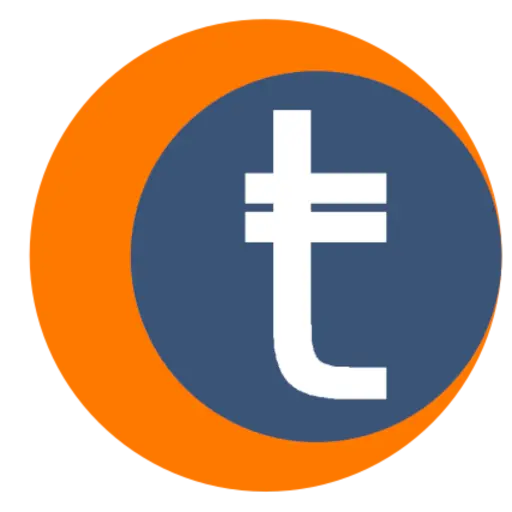

### 

# The Manifesto of the Tabbre Project

## **Charles Cunningham**

## **London. 2024.**

## **Our Mission: A Future Free from Climate Crisis and Global Poverty**

The Tabbre Project is committed to solving the climate crisis and eradicating global poverty. 

Our approach is rooted in innovation, sustainability, and fairness. We aim to accelerate the transition to a world where clean energy powers economic growth, and every individual has access to financial security through a global universal basic income (UBI).

## **The Problem: Expensive energy**

Current decarbonization efforts are inadvertently increasing the cost of energy, disproportionately affecting the developing world. 

Expensive energy traps millions in poverty, making it impossible for them to prioritise environmental sustainability. This is a crisis not just for humanity but for the planet itself.

## **Our Solution: At a global scale**

### **Cheap, Clean Energy for All** 

We will produce and distribute renewable energy on a global scale, making it affordable and accessible to everyone. By harnessing the power of floating photovoltaic solar farms in international waters, we will generate vast amounts of clean energy without disrupting natural ecosystems.

### **Global Universal Basic Income (UBI)** 

Profits from our energy sales will fund a Global UBI, providing financial security to the world’s poorest. This will empower individuals to lift themselves out of poverty while promoting financial inclusion through our decentralized BRE cryptocurrency.

### **A Decentralized Global Currency**

BRE, our blockchain based currency, will play a pivotal role in global energy transactions, establishing itself as a significant non national self sovereign reserve currency. This will help stabilise economies and reduce reliance on traditional, volatile currencies.

## **Our Vision: A Sustainable and Prosperous World**

We envision a world where technology and science create abundance, where clean renewable energy powers a flourishing global society, and where financial systems are fair and accessible to all. 

In this world, both nature and humanity thrive in harmony.

## **Core Values: Fairness, Decentralization, Transparency, Sustainability, Collaboration**

### **Fairness**

Our energy will be produced in international waters, a global commons. 

Profits will not only benefit investors but will be shared with all humanity through the Global UBI.

### **Decentralization** 

Tabbre operates on a decentralized, peer-to-peer network, reducing the control of governments and institutions over individual financial sovereignty.

### **Transparency**

As a Decentralized Autonomous Organization (DAO), Tabbre ensures that all operations are transparent, accountable, and driven by collective decision-making. Our blockchain technology provides an immutable record, fostering trust and reducing fraud.

### **Sustainability**

Our energy production is environmentally friendly, utilising abundant materials like plastics and aluminium, avoiding rare earth elements, and ensuring all materials are recyclable. Our floating solar farms, located in sterile oceanic gyres, generate electricity with minimal environmental impact.

### **Collaboration** 

We are building a global community united by a shared vision of a sustainable future. Openness, collaboration, and rewarding initiative are at the heart of our approach.

## 

## **Conclusion: A Call to Action**

The Tabbre Project is more than just a solution.

Tabbre is a movement towards a fairer, cleaner, and more prosperous world. By combining renewable energy, financial innovation, and decentralized governance, we aim to transform the global landscape to help end poverty, stabilise economies, and ensure a sustainable future for all. 

# **Join us in creating a world where everyone has the opportunity to thrive**.

