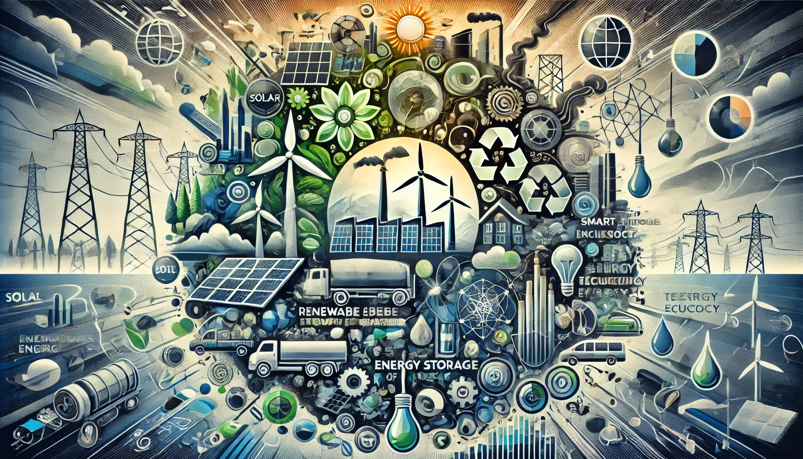

# Bitcoin Energy Consumption

**Date: 		20241003**

**Version: 	1.0**

## Contents

[TOC]

## Introduction

The report analyses how much energy is currently used by the Bitcoin network.

## Bitcoin Supply

There are currently approximately 19.5 million Bitcoins in circulation. The maximum supply of Bitcoin is capped at 21 million coins, which is expected to be reached around the year 2140 due to the halving mechanism built into the Bitcoin protocol.
## Bitcoin Network Energy Consumption

### Annual Electricity Consumption

The Bitcoin network currently consumes approximately 160 terawatt-hours (TWh) of electricity annually[1]. To put this into perspective:
This is more than the entire electricity consumption of Argentina[1].
It represents about 0.5% of global energy consumption[1].
It's roughly 7 times more electricity than all of Google's global operations[1].

### Comparison to Other Systems

Bitcoin's energy usage is about 2% of the annual electricity consumption of the United States[1].
One Bitcoin transaction can consume up to 1,200 kWh of energy, which is equivalent to almost 100,000 VISA transactions[1].

### Environmental Impact

Bitcoin mining generates around 22-23 million metric tons of carbon dioxide annually[1].
The network's operations emit approximately 65 megatons of carbon dioxide into the atmosphere each year, comparable to the emissions of Greece[1].

### Mining Industry

The Bitcoin mining industry generates an average of $56 million daily[1].
It's important to note that these figures are estimates and can fluctuate based on various factors such as Bitcoin's price, mining difficulty, and the efficiency of mining equipment. The energy consumption of the Bitcoin network remains a controversial aspect of the cryptocurrency, with ongoing debates about its sustainability and environmental impact.

## Citations:

[1] https://buybitcoinworldwide.com/bitcoin-mining-statistics/
[2] https://digiconomist.net/bitcoin-energy-consumption
[3] https://www.statista.com/statistics/881472/worldwide-bitcoin-energy-consumption/
[4] https://ccaf.io/cbnsi/cbeci
[5] https://rmi.org/cryptocurrencys-energy-consumption-problem/
[6] https://www.statista.com/statistics/881541/bitcoin-energy-consumption-transaction-comparison-visa/
[7] https://hbr.org/2021/05/how-much-energy-does-bitcoin-actually-consume
[8] https://www.nytimes.com/interactive/2021/09/03/climate/bitcoin-carbon-footprint-electricity.html