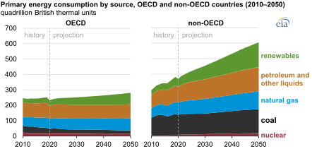
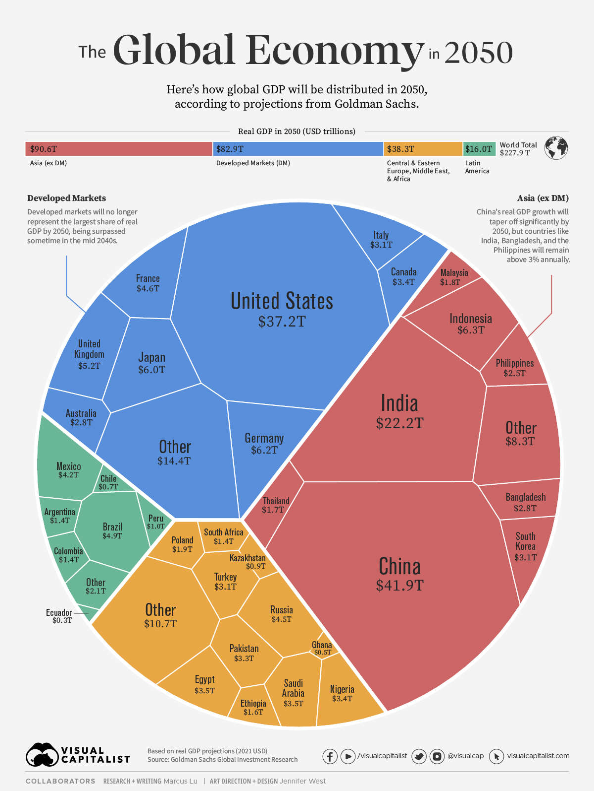
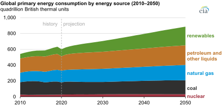
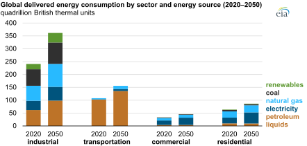

# **Tabbre  Research  Report**

|   |  |
| :---- | ----: |

## **Key Predictions 2050**
## **Date: 		2024-10-03**
## **Version: 	1.0**

 

# **Index**

- [**Summary	3**](#summary)

- [**GDP Projections for 2050	4**](#gdp-projections-for-2050)

- [**GDP Trends	5**](#gdp-trends)

- [**GDP growth rate between now and 2050	6**](#gdp-growth-rate-between-now-and-2050)
- [**Fossil fuel consumption between now and 2050	7**](#fossil-fuel-consumption-between-now-and-2050)

- [**Total global energy consumption between now and 2050	8**](#total-global-energy-consumption-between-now-and-2050)

- 
  [**Projected energy consumption trends for non-OECD countries	10**](#projected-energy-consumption-trends-for-non-oecd-countries)

- [**EIA Projections	11**](#eia-projections)

# **Summary** {#summary}

This report was prepared using perplexity.ai to record current informed opinion about future trends in global energy consumption and economic output.

**The key findings are:**

1. **GDP will double by 2050, from c. $110 tn USD to c. $220 tn USD.**  
2. **Global energy consumption will increase by c. 50%, however fossil fuels will still be the dominant energy source.**

Source:   
[https://www.eia.gov/todayinenergy/images/2021.10.07/chart2.svg](https://www.eia.gov/todayinenergy/images/2021.10.07/chart2.svg)

# **GDP Projections for 2050** {#gdp-projections-for-2050}

# 
Source: [https://www.visualcapitalist.com/visualizing-the-future-global-economy-by-gdp-in-2050/](https://www.visualcapitalist.com/visualizing-the-future-global-economy-by-gdp-in-2050/)

projected energy consumption trends for non-OECD countriesBased on projections from various economic forecasts, the global economy is expected to undergo significant shifts by 2050:

**Global GDP Growth**

* The world economy is projected to be about twice as large in 2050 compared to 2024, with an average annual growth rate of around 2.5%\[2\].

**Regional Shifts**

* Asia is expected to become the dominant economic region, accounting for 40-53% of global GDP by 20501\.  
* The share of Developed Markets in global GDP is projected to decline from over 77% in 2000 to around 36% by 2050\[1\].

**Top Economies**

By 2050, the projected top 5 economies by GDP are:

1. China ($41.9 trillion)  
2. United States ($37.2 trillion)  
3. India ($22.2 trillion)  
4. Indonesia ($6.3 trillion)  
5. Germany ($6.2 trillion)\[3\]

# **GDP Trends** {#gdp-trends}

**Rise of Emerging Markets**

* Emerging markets' share of the world economy will exceed 50% around 2028 and reach about 60% by 2050\[2\].  
* Indonesia is expected to become the 4th largest economy, surpassing Brazil and Russia as the largest emerging market\[3\].

**Demographic Factors**

* Countries with rapid population growth, especially in Sub-Saharan Africa, are projected to see significant economic expansion\[2\].  
* Aging populations in developed countries may pose challenges for economic growth and public finances\[2\].

**Technology and Productivity**

* The United States is expected to retain its position as the world's largest economy, driven by advances in areas like artificial intelligence\[2\].  
* Productivity catch-up will be a key factor in determining which countries achieve the fastest growth in GDP per capita\[2\].

**Climate Considerations**

* Global average surface temperature is projected to rise to about 1.8°C above pre-industrial levels by 2050, potentially impacting economic forecasts\[2\].

While these projections provide insight into potential future economic landscapes, it's important to note that long-term forecasts are subject to significant uncertainty and can be affected by various unforeseen factors.

## **Citations:** {#citations:}

\[1\] [https://www.visualcapitalist.com/visualizing-the-future-global-economy-by-gdp-in-2050/](https://www.visualcapitalist.com/visualizing-the-future-global-economy-by-gdp-in-2050/)  
\[2\] [https://www.capitaleconomics.com/what-will-global-economy-look-2050](https://www.capitaleconomics.com/what-will-global-economy-look-2050)  
\[3\] [https://www.visualcapitalist.com/top-economies-in-the-world-1980-2075/](https://www.visualcapitalist.com/top-economies-in-the-world-1980-2075/)  
\[4\] [https://www.pwc.com/gx/en/research-insights/economy/the-world-in-2050.html](https://www.pwc.com/gx/en/research-insights/economy/the-world-in-2050.html)  
\[5\] [https://espas.secure.europarl.europa.eu/orbis/system/files/generated/document/en/Long-termMacroeconomicForecasts\_KeyTrends.pdf](https://espas.secure.europarl.europa.eu/orbis/system/files/generated/document/en/Long-termMacroeconomicForecasts_KeyTrends.pdf)  
\[6\] [https://www.bbc.com/travel/article/20200322-five-superpowers-ruling-the-world-in-2050](https://www.bbc.com/travel/article/20200322-five-superpowers-ruling-the-world-in-2050)  
\[7\] [https://documents1.worldbank.org/curated/en/192421468341095824/pdf/360210rev0The0Road0to0205001PUBLIC1.pdf](https://documents1.worldbank.org/curated/en/192421468341095824/pdf/360210rev0The0Road0to0205001PUBLIC1.pdf)

\[8\] [https://www.statista.com/statistics/674491/top-10-countries-with-highest-gdp/](https://www.statista.com/statistics/674491/top-10-countries-with-highest-gdp/)

# **GDP growth rate between now and 2050** {#gdp-growth-rate-between-now-and-2050}

Based on the search results, the estimated world GDP growth rate between now and 2050 is projected to be around 2.5% annually on average. Specifically:

1. Capital Economics forecasts long-term global GDP growth of 2.5% per annum, which would result in the world economy being about twice as large by 2050 compared to last year\[5\].  
2. The IMF's World Economic Outlook projects global growth to continue at 3.2% in 2024 and 2025, the same pace as in 2023\. However, their forecast for global growth five years from now is lower at 3.1%, which they note is the lowest in decades\[2\].  
3. The UN's World Economic Situation and Prospects report for 2024 forecasts a deceleration in global GDP growth, from an estimated 2.7% in 2023 to 2.4% in 2024, indicating a continuation of sluggish growth trends\[1\].  
4. PwC's Global Economy Watch projections show global GDP growth (at market exchange rates) declining slightly from 2.7% in 2024 to 2.6% in 2025, and then averaging 2.5% for 2026-2029\[3\].

While there are slight variations in the projections, the overall consensus points to a global GDP growth rate of around 2.5% annually between now and 2050, which is lower than the historical average of 3.7% between 2000 and 2019\[5\].

## **Citations:** {#citations:-1}

\[1\] [https://www.un.org/sustainabledevelopment/blog/2024/01/overview-world-economic-situation-and-prospects-2024/](https://www.un.org/sustainabledevelopment/blog/2024/01/overview-world-economic-situation-and-prospects-2024/)  
\[2\] [https://www.imf.org/en/Publications/WEO/Issues/2024/04/16/world-economic-outlook-april-2024](https://www.imf.org/en/Publications/WEO/Issues/2024/04/16/world-economic-outlook-april-2024)  
\[3\] [https://www.pwc.com/gx/en/research-insights/economy/global-economy-watch/projections.html](https://www.pwc.com/gx/en/research-insights/economy/global-economy-watch/projections.html)  
\[4\] [https://www.visualcapitalist.com/visualizing-the-future-global-economy-by-gdp-in-2050/](https://www.visualcapitalist.com/visualizing-the-future-global-economy-by-gdp-in-2050/)  
\[5\] [https://www.capitaleconomics.com/what-will-global-economy-look-2050](https://www.capitaleconomics.com/what-will-global-economy-look-2050)  
\[6\] [https://www.visualcapitalist.com/top-economies-in-the-world-1980-2075/](https://www.visualcapitalist.com/top-economies-in-the-world-1980-2075/)  
\[7\] [https://www.pwc.com/gx/en/research-insights/economy/the-world-in-2050.html](https://www.pwc.com/gx/en/research-insights/economy/the-world-in-2050.html)

\[8\] [https://espas.secure.europarl.europa.eu/orbis/system/files/generated/document/en/Long-termMacroeconomicForecasts\_KeyTrends.pdf](https://espas.secure.europarl.europa.eu/orbis/system/files/generated/document/en/Long-termMacroeconomicForecasts_KeyTrends.pdf)

# **Fossil fuel consumption between now and 2050** {#fossil-fuel-consumption-between-now-and-2050}

Based on the search results, the expected rate of growth of fossil fuel consumption between now and 2050 is projected to be low or even negative, with significant variations across different fossil fuels and sectors. Here are the key points:

1. Overall fossil fuel demand is likely to flatten or decline through mid-century\[1\]. The share of fossil fuels in global energy consumption is expected to decrease substantially, potentially halving to reach 41% by 2050\[3\].  
2. Natural gas demand is projected to remain strong or even increase:  
   * It could rise as much as 47% by 2050\[1\].  
   * The EIA projects increased consumption of natural gas through 2050, particularly in the industrial sector of non-OECD countries\[2\].  
3. Oil consumption trends vary by sector:  
   * Oil use in on-road transportation is likely to fall by 50% or more by mid-century\[1\].  
   * However, industrial use of petroleum liquids as feedstock is expected to grow, especially in the chemicals industry\[2\].  
4. Coal consumption is projected to decrease significantly:  
   * Coal-powered electricity generation is expected to fall by more than half by 2050 from today's levels\[1\].  
   * However, industrial coal use may expand in non-OECD countries\[2\].  
5. In the most optimistic scenario for emissions reduction (the "Rupture" scenario), fossil fuels would only meet 40% of the world's primary energy demand in 2050\[4\].  
6. The IEA's Net Zero by 2050 scenario envisions fossil fuels falling from almost four-fifths of total energy supply today to slightly over one-fifth by 2050\[5\].

It's important to note that these projections vary depending on the scenario and assumptions used, particularly regarding policy changes and technological advancements in clean energy alternatives.

## **Citations:** 

\[1\] [https://rhg.com/research/global-fossil-fuel-demand/](https://rhg.com/research/global-fossil-fuel-demand/)  
\[2\] [https://www.eia.gov/todayinenergy/detail.php?id=49876](https://www.eia.gov/todayinenergy/detail.php?id=49876)  
\[3\] [https://eneroutlook.enerdata.net/projection-fossil-primary-consumption.html](https://eneroutlook.enerdata.net/projection-fossil-primary-consumption.html)  
\[4\] [https://totalenergies.com/news/energy-outlook-2023-our-insights-energy-transition-2050](https://totalenergies.com/news/energy-outlook-2023-our-insights-energy-transition-2050)  
\[5\] [https://www.iea.org/reports/net-zero-by-2050](https://www.iea.org/reports/net-zero-by-2050)  
\[6\] [https://corporate.exxonmobil.com/sustainability-and-reports/global-outlook](https://corporate.exxonmobil.com/sustainability-and-reports/global-outlook)  
\[7\] [https://www.capitaleconomics.com/what-will-global-economy-look-2050](https://www.capitaleconomics.com/what-will-global-economy-look-2050)

\[8\] [https://www.irena.org/-/media/Files/IRENA/Agency/Publication/2018/Apr/IRENA\_Report\_GET\_2018.pdf](https://www.irena.org/-/media/Files/IRENA/Agency/Publication/2018/Apr/IRENA_Report_GET_2018.pdf)

# **Total global energy consumption between now and 2050** {#total-global-energy-consumption-between-now-and-2050}

Based on the search results, the expected rate of growth of total global energy consumption between now and 2050 varies depending on the scenario, but generally shows moderate growth. Here are the key points:

1. The U.S. Energy Information Administration (EIA) projects that global energy consumption will increase nearly 50% over the next 30 years, which translates to an average annual growth rate of about 1.4%\[1\].  
2. ExxonMobil's Global Outlook forecasts a 15% increase in energy use by 2050, which equates to an average annual growth rate of approximately 0.5%\[2\].  
3. TotalEnergies presents multiple scenarios:  
   * The "Current Course & Speed" scenario forecasts a 0.7% per year increase in total primary energy demand\[3\].  
   * The "Rupture" scenario, which assumes more aggressive energy efficiency measures, projects a 0.1% per year increase in total primary energy demand\[3\].  
4. The International Energy Agency's (IEA) Net Zero by 2050 scenario envisions global energy demand in 2050 being around 8% smaller than today, despite serving an economy more than twice as big and a population with 2 billion more people\[4\]. This implies a slight decrease in energy consumption over the period.

The variations in these projections stem from different assumptions about factors such as economic growth, population increase, energy efficiency improvements, and the pace of transition to renewable energy sources. Overall, the consensus seems to be that global energy consumption will grow, but at a slower rate than in previous decades, with some optimistic scenarios even projecting a slight decrease.

## **Citations:**

\[1\] [https://www.eia.gov/todayinenergy/detail.php?id=49876](https://www.eia.gov/todayinenergy/detail.php?id=49876)  
\[2\] [https://corporate.exxonmobil.com/sustainability-and-reports/global-outlook](https://corporate.exxonmobil.com/sustainability-and-reports/global-outlook)  
\[3\] [https://totalenergies.com/news/energy-outlook-2023-our-insights-energy-transition-2050](https://totalenergies.com/news/energy-outlook-2023-our-insights-energy-transition-2050)  
\[4\] [https://www.iea.org/reports/net-zero-by-2050](https://www.iea.org/reports/net-zero-by-2050)  
\[5\] [https://eneroutlook.enerdata.net/forecast-world-energy-primary-consumption.html](https://eneroutlook.enerdata.net/forecast-world-energy-primary-consumption.html)  
\[6\] [https://www.iea.org/reports/world-energy-outlook-2022/outlook-for-electricity](https://www.iea.org/reports/world-energy-outlook-2022/outlook-for-electricity)  
\[7\] [https://eneroutlook.enerdata.net/forecast-world-final-energy-consumption.html](https://eneroutlook.enerdata.net/forecast-world-final-energy-consumption.html)

\[8\] [https://rhg.com/research/global-fossil-fuel-demand/](https://rhg.com/research/global-fossil-fuel-demand/)

# **Projected energy consumption trends for non-OECD countries** {#projected-energy-consumption-trends-for-non-oecd-countries}

Based on the search results, here are the key projected energy consumption trends for non-OECD countries:

Overall Growth:

1. Non-OECD countries are expected to see significant growth in energy consumption through 2050, driven by population growth, economic development, and rising living standards1.  
2. Transportation Sector:  
* Energy consumption in the transportation sector of non-OECD countries is projected to surpass that of OECD countries, having done so for the first time in 2020\[2\].  
* Non-OECD transportation energy consumption is expected to return to 2019 levels by 2022, faster than OECD countries\[2\].  
3. Residential Sector:  
* Electricity will account for more than half of the energy used in households by 2050, up from 33% in 2020\[1\].  
* Demand for cooling is expected to increase significantly, with air conditioner ownership in China projected to expand by around 40% from current levels by 2030\[3\].  
4. Commercial Buildings:  
* Electricity is projected to make up 64% of energy consumption in non-OECD commercial buildings by 2050\[1\].  
5. Industrial Sector:  
* The industrial sector will be the main contributor to growth in global natural gas consumption through 2050, largely in non-OECD countries\[1\].  
* Industrial coal use will expand fastest in non-OECD countries, where energy-intensive industries such as iron and steel production are growing more quickly than in OECD countries\[1\].  
* Non-energy-intensive manufacturing's share of overall industrial energy consumption is projected to increase from 34% to 37% between 2020 and 2030 in non-OECD countries\[2\].  
6. Renewable Energy:  
* Renewables will be the fastest-growing energy source for both OECD and non-OECD countries\[1\].  
* However, in some scenarios, low-carbon energies are projected to meet only around half of the growth in energy demand in the Global South\[4\].  
7. Fossil Fuels:  
* Coal and nuclear use are expected to increase in non-OECD countries, offsetting decreases in OECD countries\[1\].  
* Natural gas is likely to be used as a transition fuel in many non-OECD countries\[4\].

These projections highlight the significant role non-OECD countries will play in global energy consumption trends, with substantial growth expected across various sectors, particularly in electricity demand and industrial energy use.

## **Citations:** 

\[1\] [https://www.eia.gov/todayinenergy/detail.php?id=49876](https://www.eia.gov/todayinenergy/detail.php?id=49876)  
\[2\] [https://www.eia.gov/outlooks/ieo/consumption/sub-topic-02.php](https://www.eia.gov/outlooks/ieo/consumption/sub-topic-02.php)  
\[3\] [https://www.iea.org/reports/world-energy-outlook-2022/outlook-for-electricity](https://www.iea.org/reports/world-energy-outlook-2022/outlook-for-electricity)  
\[4\] [https://totalenergies.com/news/energy-outlook-2023-our-insights-energy-transition-2050](https://totalenergies.com/news/energy-outlook-2023-our-insights-energy-transition-2050)  
\[5\] [https://eneroutlook.enerdata.net/forecast-world-final-energy-consumption.html](https://eneroutlook.enerdata.net/forecast-world-final-energy-consumption.html)  
\[6\] [https://www.oecd-ilibrary.org/docserver/weo-2006-3-en.pdf?accname=guest\&checksum=87DA4E22FD6007977894BEBFD9CD7689\&expires=1726397093\&id=id](https://www.oecd-ilibrary.org/docserver/weo-2006-3-en.pdf?accname=guest&checksum=87DA4E22FD6007977894BEBFD9CD7689&expires=1726397093&id=id)  
\[7\] [https://eneroutlook.enerdata.net/forecast-world-energy-primary-consumption.html](https://eneroutlook.enerdata.net/forecast-world-energy-primary-consumption.html)

\[8\] [https://www.energyinst.org/statistical-review](https://www.energyinst.org/statistical-review)

# **EIA Projections** {#eia-projections}

source: [https://www.eia.gov/todayinenergy/detail.php?id=49876](https://www.eia.gov/todayinenergy/detail.php?id=49876)  

# 

Source:   
[https://www.eia.gov/todayinenergy/images/2021.10.07/chart2.svg](https://www.eia.gov/todayinenergy/images/2021.10.07/chart2.svg)

# 
Source:   
[https://www.eia.gov/todayinenergy/images/2021.10.07/chart3.svg](https://www.eia.gov/todayinenergy/images/2021.10.07/chart3.svg)

